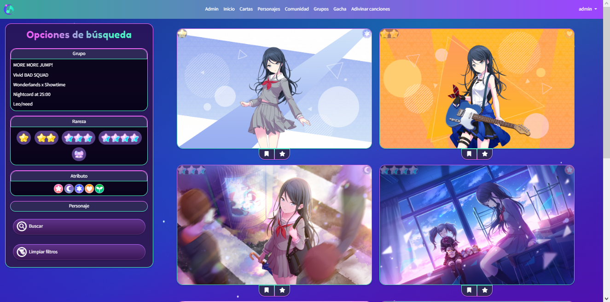
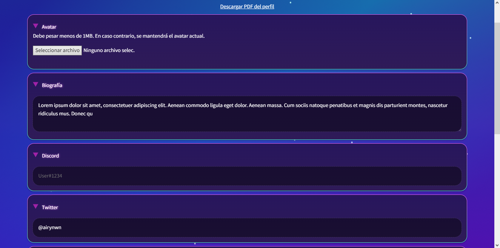

---

# Comunidad de Project Sekai

*«SekaiSchool» | Laura Alcón García | Curso 2022/23*

## 1. Descripción general del proyecto

SekaiSchool consiste en una comunidad y base de datos dedicada al videojuego gacha de ritmo Project Sekai y ambientada en este, con el propósito de disponer de información y recursos del juego, como los personajes y los grupos de este, así como una lista de las cartas existentes.

Al ser una comunidad, los usuarios podrán tener una cuenta con la que controlar su colección de cartas y su lista de deseos, lo cual se almacenará en su perfil personal junto con otros datos personalizables. También podrán interactuar con otros usuarios mediante publicaciones y valoraciones como una red social.

## 2. Funcionalidad principal de la aplicación

La funcionalidad principal es la creación de una página web que permita a los jugadores de Project Sekai acceder a información básica del juego, gestionar sus cartas y hacer uso de la sección de comunidad para conocer a otras personas con interés en el juego.

Los visitantes de la página podrán acceder a los recursos del juego (cartas, personajes y grupos) y, al registrarse o iniciar sesión como usuarios, podrán interactuar con los demás usuarios o editar su perfil.

Los administradores tendrán un portal de administración a través del cual podrán gestionar personajes, grupos, cartas, trivias, preguntas, respuestas, relaciones, canciones y usuarios.

Para conseguir esto, es importante tener en cuenta el estilo y la ambientación de la página, ya que la idea es que el sitio web tenga una apariencia atractiva y similar a la del juego, de forma que logre captar la atención de sus usuarios y sea fácil de usar.

## 3. Objetivos generales

* Objetivo: acceso a recursos del videojuego e interacción con su comunidad.
* Casos de uso:
  * Visitante: "registrarse", "iniciar sesión", "usar simulador gacha", "jugar a adivinar la canción", "ver cartas", "ver personajes", "ver grupos"
  * Usuario: "crear publicación", "valorar publicación", "ver perfil y comunidad", "gestionar colección".
  * Administrador: "gestionar cartas", "gestionar personajes", "gestionar grupos", "gestionar trivias", "gestionar preguntas", "gestionar respuestas", "gestionar relaciones," "gestionar canciones", "validar/bloquear usuario".

## 4. Elemento de innovación

* Minijuego de adivinar el nombre de la canción del juego que suena.
* Simulador de obtención de cartas aleatoriamente (gacha).

---

# Vistas de la aplicación

## Portal de administración

* El administrador puede **crear**, **modificar** o **eliminar** los siguientes recursos: grupos, personajes, cartas, trivias, preguntas, respuestas, relaciones, canciones.
* El usuario puede **validar** o **bloquear** el acceso a los usuarios.

## Inicio

En el inicio se muestra información sobre el videojuego y la página, tres cartas de rareza 4 aleatorias, y un calendario con eventos marcados para mostrar la fecha de cumpleaños de los personajes.

## Cartas

Lista de cartas existentes.

* Se van mostrando más a medida que se scrollea hacia abajo (scroll infinito).
* Si lo mira un usuario, puede añadir las cartas a su colección o lista de deseos.
* Permite filtrar por grupo, rareza, atributo y/o personaje o limpiar filtros.
* La última búsqueda se guarda y se selecciona automáticamente al volver.

## Personajes

Lista de personajes con información de cada uno, imágenes y texto de su color.

* Datos básicos (preguntas y respuestas genéricas)
* Personalidad
* Historia
* Trivia
* Relaciones con otros personajes
* Cómics del grupo al que pertenece

## Comunidad

Comunidad de usuarios estilo Twitter con clasificación por valoraciones (top 10).

* Los posts se pueden ordenar por más reciente o más popular.
* Se pueden valorar posts positivamente.
* Los usuarios pueden borrar sus propios posts y los administradores pueden borrar todos.
* Máximo de 50 posts.

## Grupos

Lista de grupos con información e imágenes de cada uno.

* Menú de selección de grupos con vídeo de fondo por defecto
* Miembros e historia del grupo

## Simulador Gacha

Simulador de obtención de cartas de manera aleatoria (gacha) con los porcentajes reales del juego.

* Interfaz gacha similar a la del juego
* Tabla con información sobre las tiradas

## Adivina la canción

Minijuego de adivinar la canción aleatoria del juego que suena en el audio.

* Intentos infinitos
* Se pueden escuchar los 2 primeros segundos y aumenta con cada fallo
* Al acertar se genera una nueva canción aleatoria que adivinar
* Solución encriptada para evitar trampas

## Perfil

Perfil de usuario.

* Avatar, biografía y cumpleaños
* Grupo y personaje favoritos
* Redes sociales
* Últimos 10 posts
* Colección de cartas y lista de deseos
* Edición y personalización del perfil
* Generación de PDF con datos del perfil del usuario

## Login y Registro

